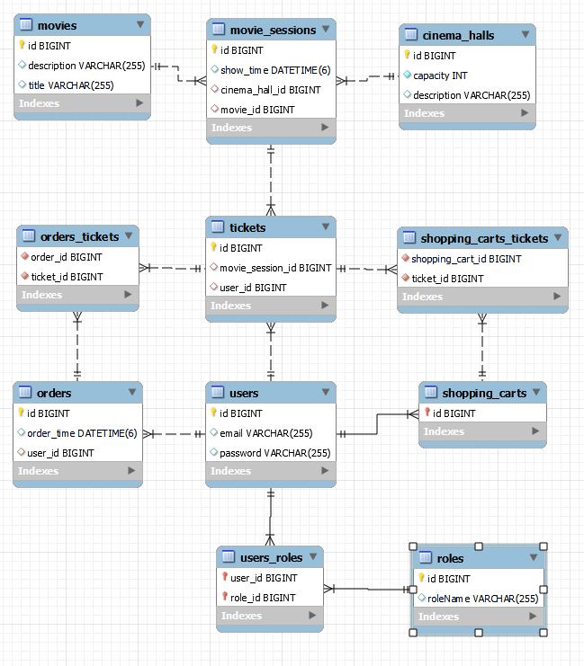

# Cinema-Service
This is simple simulator of cinema service for reservation tickets, that supports registration, authentication and CRUD operations.
___

## Features:
* register or login as user
* create and find movies
* create and find available movie sessions
* creating shopping cart
* add tickets to shopping cart
* complete an order
---

## Project architecture:
The Cinema-Service is based on 3-layer architecture:
1. Controllers, which handle requests, call services and send responses
2. Services - there are all business logic
3. DAO, which handle CRUD operations to database

### Model structure

---

## Technologies used in project:
* Java 11
* MySql 8.0.29
* Hibernate 5.6.8
* Maven